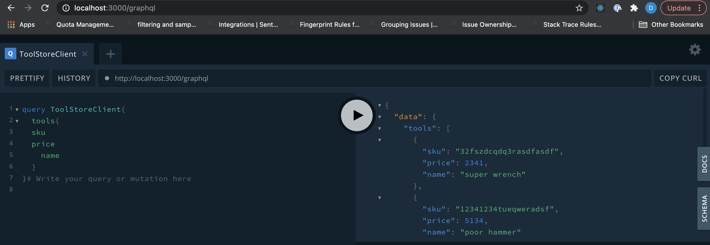
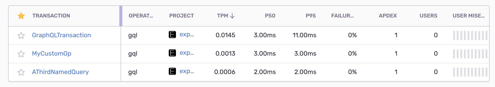

# Express gql
Repo is intended to be used as an example of one approach to instrumenting Sentry's performance feature into an express gql backend. 

# Node version

```node -v v14.2.0```
# Setup

``` npm install ```

# Start Server

``` npm start ```

# Example POST 
Navigate to `localhost:3000/graphql`. POSTs via the browser tool will be named `IntrospectionQuery` by default. You can change this behavior by naming your query - in this case we added `ToolStoreClient`:



Alternatively, you can include the following JSON body in postman to name your transactions:

```{"operationName":"MyQueryName","query":"query MyQueryName{tools{sku name price}}"}```

# Performance Dashboard
Transaction categories will use the operation name you specify or default to `GraphQLTransaction` if none is supplied. GQL resolvers are be captured in span level detail thanks to lifecycle hooks in `plugin.ts`.




# Future work

This demo is currently does not include any Sentry build process/error triage workflows (e.g. creating releases, uploading artifacts to sentry,error simulation etc.). 

    